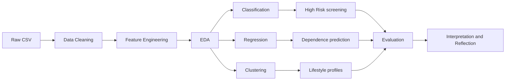
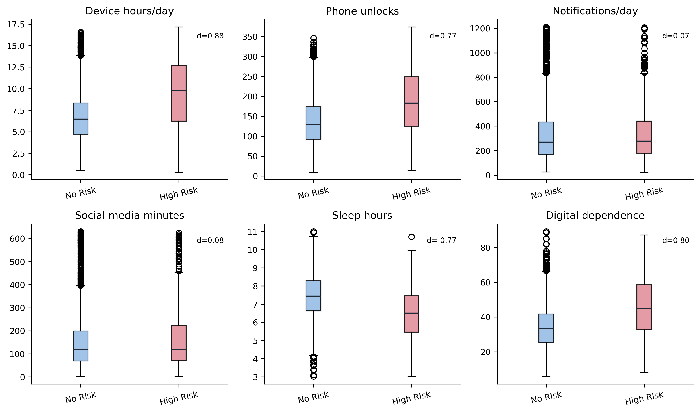
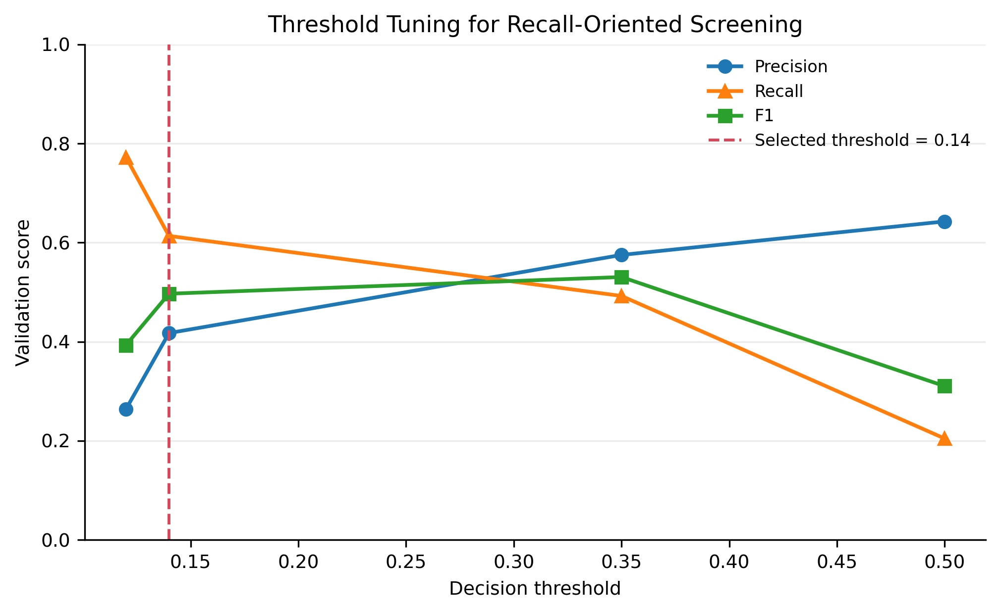
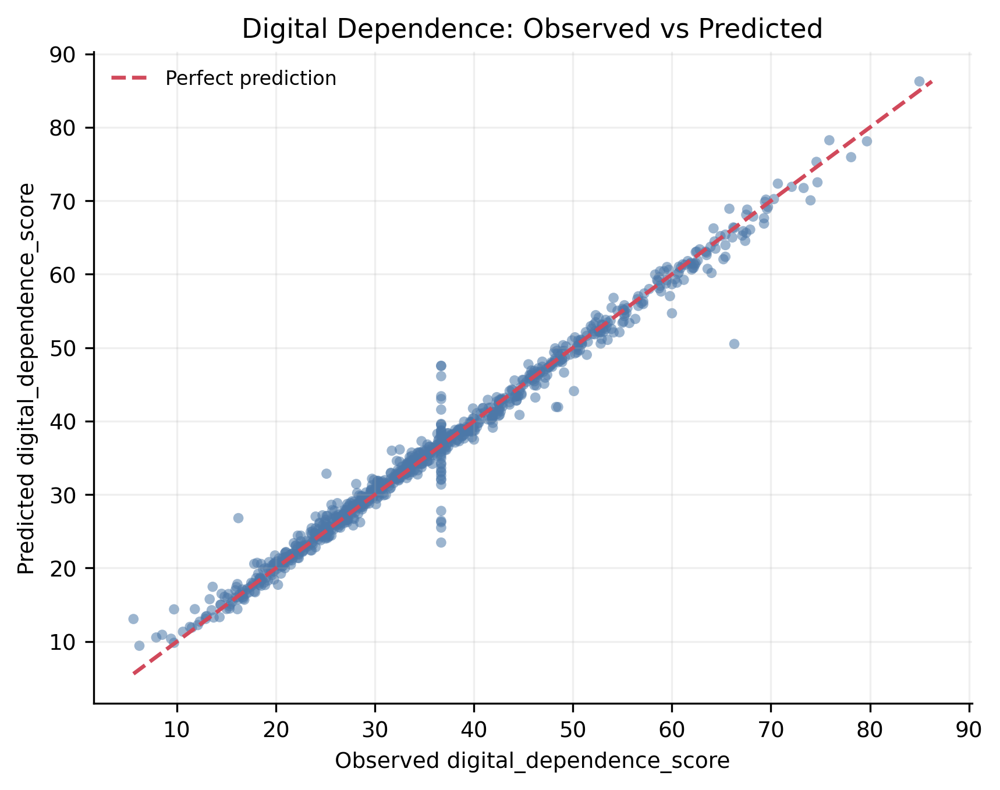
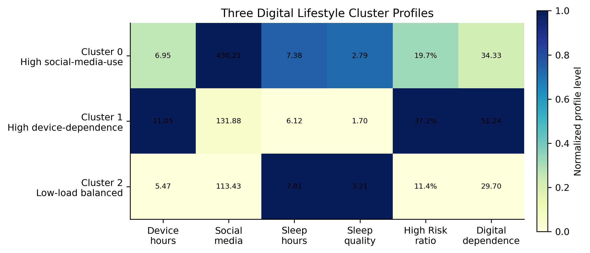

  <h1>Big Data Analysis and Applications</h1>
  <h3>Digital Lifestyle Analysis</h3>
  
High-Risk Screening · Digital Dependence Prediction · Lifestyle Profile Clustering

  

    
    
    
    
  

## 快速入口

| 入口 | 链接 |
|---|---|
| **Final Report PDF** | [期末考查报告_数字生活方式分析/final_submit/大数据分析与应用期末考查报告.pdf](期末考查报告_数字生活方式分析/final_submit/大数据分析与应用期末考查报告.pdf) |
| **Final Report DOCX** | [期末考查报告_数字生活方式分析/final_submit/大数据分析与应用期末考查报告.docx](期末考查报告_数字生活方式分析/final_submit/大数据分析与应用期末考查报告.docx) |
| **Project Details** | [期末考查报告_数字生活方式分析/](期末考查报告_数字生活方式分析/) |
| **Complete Runnable Code** | [期末考查报告_数字生活方式分析/appendix_A_complete_code.py](期末考查报告_数字生活方式分析/appendix_A_complete_code.py) |
| **Final Figures** | [期末考查报告_数字生活方式分析/figures/final_report/](期末考查报告_数字生活方式分析/figures/final_report/) |
| **GitHub Project Page** | [Open final project folder on GitHub](https://github.com/hansu650/Big-Data-Homework/tree/main/%E6%9C%9F%E6%9C%AB%E8%80%83%E6%9F%A5%E6%8A%A5%E5%91%8A_%E6%95%B0%E5%AD%97%E7%94%9F%E6%B4%BB%E6%96%B9%E5%BC%8F%E5%88%86%E6%9E%90) |

## 项目结论

> 在本数据集中，持续设备使用和较弱的睡眠平衡是比通知数量更明显的数字依赖预警信号。模型可以支持早期筛查、数字依赖估计和差异化生活方式指导，但不能替代个人诊断或最终判断。

本仓库为《大数据分析与应用》课程作业与期末考查项目仓库。期末项目围绕 **Digital Lifestyle Analysis** 展开，使用 2025 Digital Lifestyle Benchmark Dataset 完成数据清洗、特征工程、统计可视化、分类、回归、聚类、模型评估和结果解释。

## Key Results

| Task | Final Method | Key Result | Interpretation |
|---|---|---|---|
| High Risk Classification | Gradient Boosting, threshold=0.14 | Recall=0.6420, F1=0.5355, PR-AUC=0.5084 | Recall-oriented screening reference |
| Digital Dependence Regression | Gradient Boosting | R²=0.9839, MSE=3.1471, MAE=0.9982 | Strong in-dataset prediction |
| Productivity Regression | Gradient Boosting | R²=-0.0041 | Weak prediction / negative result |
| Lifestyle Clustering | KMeans, k=3 | Silhouette=0.1860 | Exploratory profiles |
| PCA | PCA | PC1+PC2=42.41% | Auxiliary visualization only |

## Analysis Workflow

## Selected Visual Results

<table>
  <tr>
    <td align="center" width="50%">
      
       <strong>Behavioral Risk Signals</strong>
    </td>
    <td align="center" width="50%">
      
       <strong>Recall-Oriented Threshold</strong>
    </td>
  </tr>
  <tr>
    <td align="center" width="50%">
      
       <strong>Digital Dependence Prediction</strong>
    </td>
    <td align="center" width="50%">
      
       <strong>Lifestyle Profiles</strong>
    </td>
  </tr>
</table>

## Course Repository

本仓库除期末项目外，还保留课堂作业、实验和历史资料，方便回看课程学习过程。期末考查报告项目是当前最主要的提交入口。

其他课堂作业与实验

| 目录 | 内容 |
|---|---|
| `3-13/`, `3-20/`, `3-27/`, `4-3/`, `4-10/` | 按日期整理的课堂作业和阶段材料 |
| `实验一/`, `实验二/`, `实验三/`, `实验四/` | 课程实验代码、结果和资料 |
| `期末报告资料/` | 课程模板、参考资料和报告相关材料 |
| `历史零散文件/` | 旧文件归档 |

## Notes

- 数据集许可为 **CC BY 4.0**，但这不等同于整个代码仓库的许可证。
- 分类结果用于 screening reference，不是个人最终判断。
- `digital_dependence_score` 的高 R² 表示数据集内预测关系，不代表因果关系。
- `productivity_score` 是 weak prediction / negative result。
- 聚类结果用于 exploratory profiles，不代表严格自然群体。
