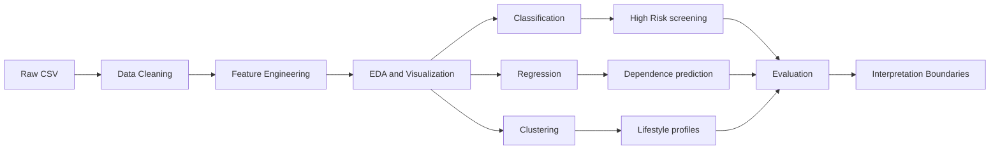
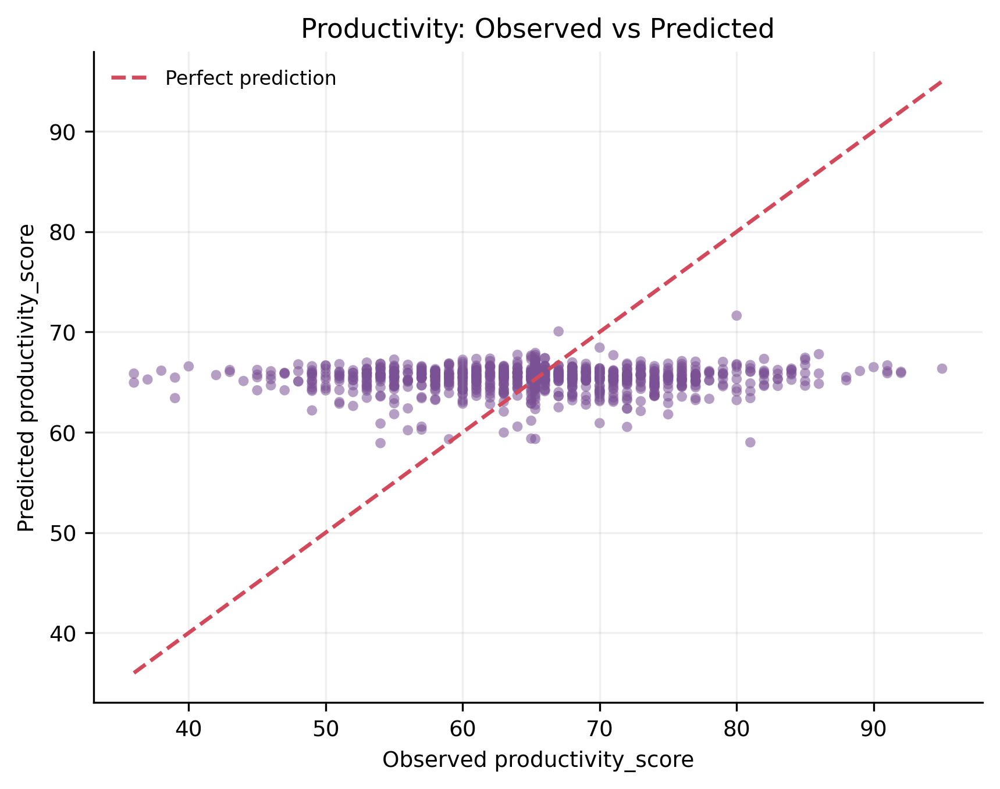

# Digital Lifestyle Analysis

## High-Risk Screening, Digital Dependence Prediction, and Lifestyle Profile Clustering

这是《大数据分析与应用》课程期末项目。项目使用 **3,500 条 fully synthetic records** 和 **24 fields**，完成 classification、regression、clustering 三类任务，并形成完整、可复现的数据分析流程。

## 1. Project Overview

本项目分析数字生活方式中的设备使用、社交媒体、睡眠、运动、通知和学习行为。报告从原始 CSV 出发，经过数据检查、特征工程、统计可视化、模型比较、阈值调节和结果解释，最终形成 Word/PDF 课程报告与完整代码。

核心目标不是证明所有模型都很强，而是把数据证据、模型结果和解释边界连接起来。

## 2. Research Question

Under an increasingly digital lifestyle, which daily behaviors should be treated as priority warning signs of digital dependence, and how can these signals guide personal self-management and public digital-wellbeing support?

## 3. Dataset

| Item | Description |
|---|---|
| Dataset | 2025 Digital Lifestyle Benchmark Dataset |
| Records | 3,500 fully synthetic records |
| Fields | 24 fields |
| Format | CSV |
| Sources | Kaggle / Hugging Face |
| Dataset license | CC BY 4.0 |
| Local raw CSV | [`data/raw/digital_lifestyle_benchmark_2025.csv`](data/raw/digital_lifestyle_benchmark_2025.csv) |
| Local processed CSV | [`data/processed/digital_lifestyle_benchmark_2025_processed.csv`](data/processed/digital_lifestyle_benchmark_2025_processed.csv) |

该数据集适合 benchmark、education 和 EDA，不用于真实个人诊断。数据集许可是 CC BY 4.0，但这不代表整个代码仓库采用该许可证。

## 4. Analysis Workflow



## 5. Key Findings

1. **Sustained device use** 和 **sleep balance** 比 notification volume 更有预警价值。
2. High Risk 分类适合作为 **early screening**，但不能作为最终个人判断。
3. `digital_dependence_score` 可以被当前数字行为和生活方式特征很好预测。
4. `productivity_score` 是 **weak prediction / negative result**，说明同一组特征不能解释所有结果。
5. 三个 lifestyle clusters 只能作为 **exploratory profiles**，不是严格自然群体。

## 6. Model Results

| Task | Final Method | Key Result | Interpretation |
|---|---|---|---|
| High Risk Classification | Gradient Boosting, threshold=0.14 | Recall=0.6420, F1=0.5355, PR-AUC=0.5084 | Recall-oriented screening reference |
| Digital Dependence Regression | Gradient Boosting | R²=0.9839, MSE=3.1471, MAE=0.9982 | Strong in-dataset prediction |
| Productivity Regression | Gradient Boosting | R²=-0.0041 | Weak prediction / negative result |
| Lifestyle Clustering | KMeans, k=3 | Silhouette=0.1860 | Exploratory profiles |
| PCA | PCA | PC1+PC2=42.41% | Auxiliary visualization only |

## 7. Visual Results

<table>
  <tr>
    <td align="center" width="50%">
      <a href="figures/final_report/fig4_high_vs_no_risk_boxplots.png">
        
      </a>
      <br><strong>Fig4:</strong> Device-use intensity and sleep balance provide stronger group signals than notification volume.
    </td>
    <td align="center" width="50%">
      <a href="figures/final_report/fig5_classification_model_comparison.png">
        
      </a>
      <br><strong>Fig5:</strong> No model dominates all default-threshold metrics.
    </td>
  </tr>
  <tr>
    <td align="center" width="50%">
      <a href="figures/final_report/fig6_threshold_tuning.png">
        
      </a>
      <br><strong>Fig6:</strong> Lower thresholds improve Recall but create more false alarms.
    </td>
    <td align="center" width="50%">
      <a href="figures/final_report/fig9_digital_dependence_observed_predicted.png">
        
      </a>
      <br><strong>Fig9:</strong> Digital dependence is strongly predicted inside the benchmark data.
    </td>
  </tr>
  <tr>
    <td align="center" width="50%">
      <a href="figures/final_report/fig10_productivity_observed_predicted.png">
        
      </a>
      <br><strong>Fig10:</strong> Productivity predictions collapse toward the mean.
    </td>
    <td align="center" width="50%">
      <a href="figures/final_report/fig13_cluster_profile_heatmap.png">
        
      </a>
      <br><strong>Fig13:</strong> The profiles are readable but not strictly separated.
    </td>
  </tr>
</table>

## 8. Practical Interpretation

**Individual:** monitor device time, long social-media sessions, and sleep balance.

**School or Community:** use screening for voluntary follow-up and differentiated guidance.

**Public:** support digital-wellbeing education, screen-time summaries, and sleep-health reminders.

这些建议来自 synthetic benchmark data，只能作为方向性分析，不是因果证明，也不是个人诊断。

## 9. Reproduction

```bash
git clone https://github.com/hansu650/Big-Data-Homework.git
cd Big-Data-Homework/期末考查报告_数字生活方式分析
pip install -r requirements.txt
python appendix_A_complete_code.py
```

## 10. Repository Structure

```text
期末考查报告_数字生活方式分析/
├─ data/
│  ├─ raw/
│  └─ processed/
├─ notebooks/
├─ src/
├─ scripts/
├─ figures/final_report/
├─ results/
├─ screenshot_tables/
├─ final_submit/
├─ overleaf_final/
├─ appendix_A_complete_code.py
├─ report_code_snippets.md
├─ requirements.txt
└─ README.md
```

## 11. Final Submission

| File | Link |
|---|---|
| Final PDF report | [`final_submit/大数据分析与应用期末考查报告.pdf`](final_submit/大数据分析与应用期末考查报告.pdf) |
| Final Word report | [`final_submit/大数据分析与应用期末考查报告.docx`](final_submit/大数据分析与应用期末考查报告.docx) |
| Final submit folder guide | [`final_submit/README.md`](final_submit/README.md) |
| Complete runnable code | [`appendix_A_complete_code.py`](appendix_A_complete_code.py) |
| Workflow summary CSV | [`results/final_workflow_report_summary.csv`](results/final_workflow_report_summary.csv) |
| Final report figures | [`figures/final_report/`](figures/final_report/) |

## 12. Interpretation Boundaries

- Classification is a **screening reference**, not a final personal judgment.
- Digital dependence is a **prediction relationship**, not a causal conclusion.
- `productivity_score` is a **negative result**, showing the boundary of the feature set.
- Clustering provides **exploratory profiles**, not strictly separated natural groups.
- PCA PC1+PC2 explains **42.41%**, so two-dimensional PCA is auxiliary visualization only.
