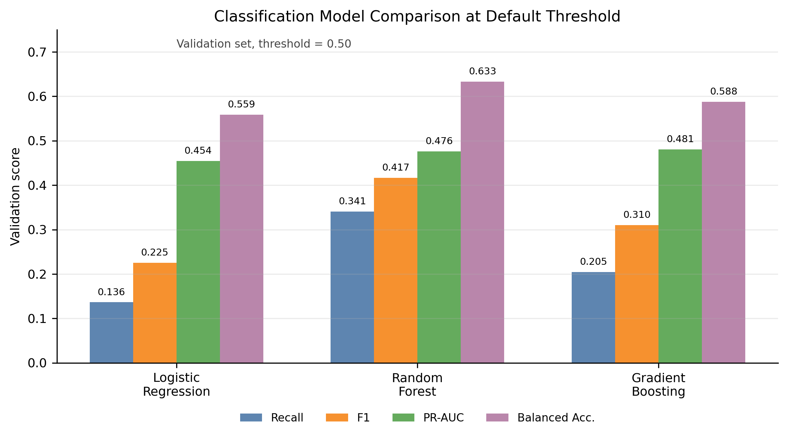

# Digital Lifestyle Analysis

**High-Risk Screening, Digital Dependence Prediction, and Lifestyle Profile Clustering**

This folder contains the final course project for **Big Data Analysis and Applications**. It includes the dataset workflow, notebooks, source code, result files, final figures, complete runnable code, and final submission documents.

## 1. Project Overview

The project studies digital lifestyle behavior with a structured benchmark dataset. The analysis follows a complete course-report workflow:

1. dataset selection and compliance checking;
2. data cleaning and feature engineering;
3. statistical analysis and visualization;
4. machine learning model training and evaluation;
5. interpretation of useful results and limitations.

The final report focuses on three tasks: **High Risk screening**, **digital dependence prediction**, and **lifestyle profile clustering**.

## 2. Research Questions

- Can `high_risk_flag` be screened with behavior and lifestyle features?
- Can `digital_dependence_score` be predicted from digital-use and lifestyle variables?
- Does `productivity_score` behave as a weak-prediction target under the same feature setting?
- Can clustering summarize readable digital lifestyle profiles?

## 3. Dataset

The project uses the **2025 Digital Lifestyle Benchmark Dataset**.

| Item | Description |
|---|---|
| Dataset type | Structured CSV |
| Records | 3,500 synthetic records |
| Fields | 24 fields |
| Sources | Kaggle / Hugging Face |
| License | CC BY 4.0 |
| Local CSV | [`data/raw/digital_lifestyle_benchmark_2025.csv`](data/raw/digital_lifestyle_benchmark_2025.csv) |

The dataset is suitable for benchmark experiments, education, EDA, and reproducible course analysis. It is **not** used for real personal diagnosis or individual-level intervention.

## 4. Analysis Workflow

```text
Dataset checking
  -> Missing/duplicate/range checks
  -> Feature engineering
  -> Leakage-controlled feature selection
  -> EDA and visualization
  -> Classification, regression, clustering
  -> Final report and interpretation
```

Important implementation materials:

- [`notebooks/`](notebooks/) records the step-by-step analysis process.
- [`src/`](src/) stores reusable helper code.
- [`appendix_A_complete_code.py`](appendix_A_complete_code.py) provides the complete runnable script.
- [`results/`](results/) stores generated result CSV files.
- [`figures/final_report/`](figures/final_report/) stores final report figures.

## 5. Key Results

| Task | Model or method | Locked result |
|---|---|---|
| High Risk classification | Gradient Boosting, threshold=0.14 | Recall=0.6420, F1=0.5355, PR-AUC=0.5084 |
| Digital dependence regression | Gradient Boosting | R²=0.9839, MSE=3.1471, MAE=0.9982 |
| Productivity regression | Regression comparison | R²=-0.0041 |
| Lifestyle clustering | KMeans k=3 | Silhouette=0.1860 |
| PCA evidence | PC1+PC2 | 42.41% explained variance |

## 6. Figure Preview

### Classification model comparison



### Threshold tuning for High Risk screening


### Digital dependence observed vs predicted


### Three lifestyle cluster profiles


## 7. Repository Structure

```text
期末考查报告_数字生活方式分析/
├─ data/
├─ notebooks/
├─ src/
├─ scripts/
├─ figures/
│  └─ final_report/
├─ results/
├─ screenshot_tables/
├─ final_submit/
├─ overleaf_final/
├─ appendix_A_complete_code.py
├─ report_code_snippets.md
├─ requirements.txt
└─ README.md
```

## 8. Reproduction

```bash
cd 期末考查报告_数字生活方式分析
pip install -r requirements.txt
python appendix_A_complete_code.py
```

The script regenerates the main workflow outputs used by the final report. Some final Word/PDF formatting steps are handled manually in Word/WPS for submission.

## 9. Final Submission Files

| File | Link |
|---|---|
| Final PDF report | [`final_submit/大数据分析与应用期末考查报告.pdf`](final_submit/大数据分析与应用期末考查报告.pdf) |
| Final Word report | [`final_submit/大数据分析与应用期末考查报告.docx`](final_submit/大数据分析与应用期末考查报告.docx) |
| Complete runnable code | [`appendix_A_complete_code.py`](appendix_A_complete_code.py) |
| Workflow summary CSV | [`results/final_workflow_report_summary.csv`](results/final_workflow_report_summary.csv) |
| Final report figures | [`figures/final_report/`](figures/final_report/) |

## 10. Interpretation Boundaries

- The High Risk classifier is a **screening reference**, not a final personal judgment.
- The digital dependence regression result is a **prediction relationship**, not causal evidence.
- `productivity_score` is a **weak-prediction result**, which shows the boundary of the current feature set.
- The clustering output gives **exploratory lifestyle profiles**, not strict natural population groups.
- The first two PCA components explain **42.41%** of the variance, so a two-dimensional PCA view cannot replace the full feature space.
